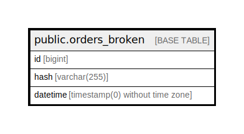

# public.orders_broken

## Description

## Columns

| Name | Type | Default | Nullable | Children | Parents | Comment |
| ---- | ---- | ------- | -------- | -------- | ------- | ------- |
| id | bigint | nextval('orders_broken_id_seq'::regclass) | false |  |  |  |
| hash | varchar(255) |  | false |  |  |  |
| datetime | timestamp(0) without time zone |  | false |  |  |  |

## Constraints

| Name | Type | Definition |
| ---- | ---- | ---------- |
| orders_broken_pkey | PRIMARY KEY | PRIMARY KEY (id) |

## Indexes

| Name | Definition |
| ---- | ---------- |
| orders_broken_pkey | CREATE UNIQUE INDEX orders_broken_pkey ON public.orders_broken USING btree (id) |

## Relations

---

> Generated by [tbls](https://github.com/k1LoW/tbls)
