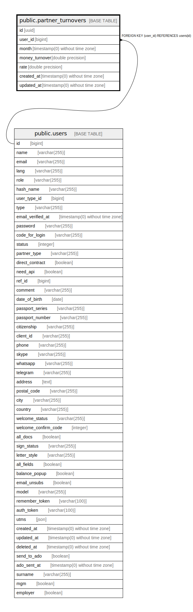

# public.partner_turnovers

## Description

## Columns

| Name | Type | Default | Nullable | Children | Parents | Comment |
| ---- | ---- | ------- | -------- | -------- | ------- | ------- |
| id | uuid |  | false |  |  |  |
| user_id | bigint |  | false |  | [public.users](public.users.md) |  |
| month | timestamp(0) without time zone | CURRENT_TIMESTAMP | false |  |  |  |
| money_turnover | double precision | '0'::double precision | false |  |  |  |
| rate | double precision | '0'::double precision | false |  |  |  |
| created_at | timestamp(0) without time zone |  | true |  |  |  |
| updated_at | timestamp(0) without time zone |  | true |  |  |  |

## Constraints

| Name | Type | Definition |
| ---- | ---- | ---------- |
| partner_turnovers_pkey | PRIMARY KEY | PRIMARY KEY (id) |
| partner_turnovers_user_id_foreign | FOREIGN KEY | FOREIGN KEY (user_id) REFERENCES users(id) |

## Indexes

| Name | Definition |
| ---- | ---------- |
| partner_turnovers_pkey | CREATE UNIQUE INDEX partner_turnovers_pkey ON public.partner_turnovers USING btree (id) |

## Relations

---

> Generated by [tbls](https://github.com/k1LoW/tbls)
