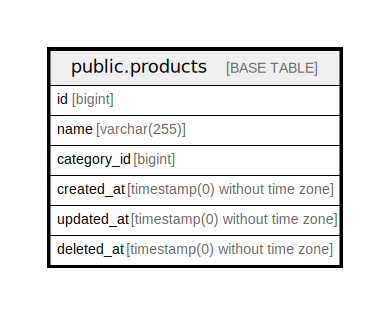

# public.products

## Description

## Columns

| Name | Type | Default | Nullable | Children | Parents | Comment |
| ---- | ---- | ------- | -------- | -------- | ------- | ------- |
| id | bigint | nextval('products_id_seq'::regclass) | false |  |  |  |
| name | varchar(255) |  | false |  |  |  |
| category_id | bigint |  | false |  |  |  |
| created_at | timestamp(0) without time zone |  | true |  |  |  |
| updated_at | timestamp(0) without time zone |  | true |  |  |  |
| deleted_at | timestamp(0) without time zone |  | true |  |  |  |

## Constraints

| Name | Type | Definition |
| ---- | ---- | ---------- |
| products_pkey | PRIMARY KEY | PRIMARY KEY (id) |

## Indexes

| Name | Definition |
| ---- | ---------- |
| products_pkey | CREATE UNIQUE INDEX products_pkey ON public.products USING btree (id) |
| products_id_index | CREATE INDEX products_id_index ON public.products USING btree (id) |

## Relations

---

> Generated by [tbls](https://github.com/k1LoW/tbls)
