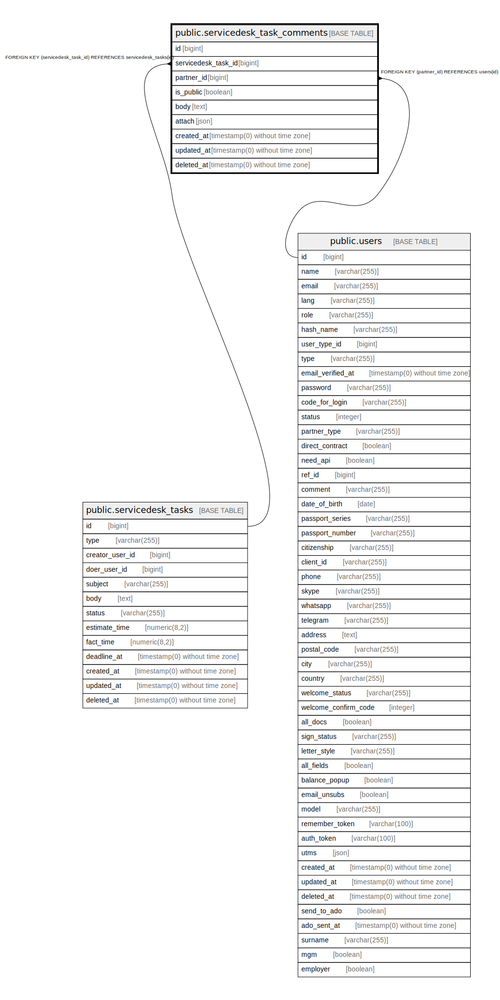

# public.servicedesk_task_comments

## Description

## Columns

| Name | Type | Default | Nullable | Children | Parents | Comment |
| ---- | ---- | ------- | -------- | -------- | ------- | ------- |
| id | bigint | nextval('servicedesk_task_comments_id_seq'::regclass) | false |  |  |  |
| servicedesk_task_id | bigint |  | false |  | [public.servicedesk_tasks](public.servicedesk_tasks.md) |  |
| partner_id | bigint |  | false |  | [public.users](public.users.md) |  |
| is_public | boolean | false | false |  |  |  |
| body | text |  | false |  |  |  |
| attach | json |  | true |  |  |  |
| created_at | timestamp(0) without time zone |  | true |  |  |  |
| updated_at | timestamp(0) without time zone |  | true |  |  |  |
| deleted_at | timestamp(0) without time zone |  | true |  |  |  |

## Constraints

| Name | Type | Definition |
| ---- | ---- | ---------- |
| servicedesk_task_comments_pkey | PRIMARY KEY | PRIMARY KEY (id) |
| servicedesk_task_comments_servicedesk_task_id_foreign | FOREIGN KEY | FOREIGN KEY (servicedesk_task_id) REFERENCES servicedesk_tasks(id) |
| servicedesk_task_comments_partner_id_foreign | FOREIGN KEY | FOREIGN KEY (partner_id) REFERENCES users(id) |

## Indexes

| Name | Definition |
| ---- | ---------- |
| servicedesk_task_comments_pkey | CREATE UNIQUE INDEX servicedesk_task_comments_pkey ON public.servicedesk_task_comments USING btree (id) |

## Relations

---

> Generated by [tbls](https://github.com/k1LoW/tbls)
