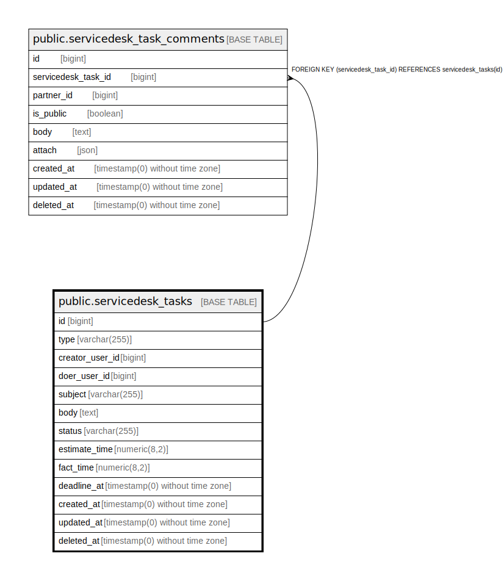

# public.servicedesk_tasks

## Description

## Columns

| Name | Type | Default | Nullable | Children | Parents | Comment |
| ---- | ---- | ------- | -------- | -------- | ------- | ------- |
| id | bigint | nextval('servicedesk_tasks_id_seq'::regclass) | false | [public.servicedesk_task_comments](public.servicedesk_task_comments.md) |  |  |
| type | varchar(255) |  | true |  |  |  |
| creator_user_id | bigint |  | false |  |  |  |
| doer_user_id | bigint |  | true |  |  |  |
| subject | varchar(255) |  | false |  |  |  |
| body | text |  | true |  |  |  |
| status | varchar(255) | 'new'::character varying | false |  |  |  |
| estimate_time | numeric(8,2) |  | true |  |  |  |
| fact_time | numeric(8,2) |  | true |  |  |  |
| deadline_at | timestamp(0) without time zone |  | true |  |  |  |
| created_at | timestamp(0) without time zone |  | true |  |  |  |
| updated_at | timestamp(0) without time zone |  | true |  |  |  |
| deleted_at | timestamp(0) without time zone |  | true |  |  |  |

## Constraints

| Name | Type | Definition |
| ---- | ---- | ---------- |
| servicedesk_tasks_pkey | PRIMARY KEY | PRIMARY KEY (id) |

## Indexes

| Name | Definition |
| ---- | ---------- |
| servicedesk_tasks_pkey | CREATE UNIQUE INDEX servicedesk_tasks_pkey ON public.servicedesk_tasks USING btree (id) |

## Relations

---

> Generated by [tbls](https://github.com/k1LoW/tbls)
