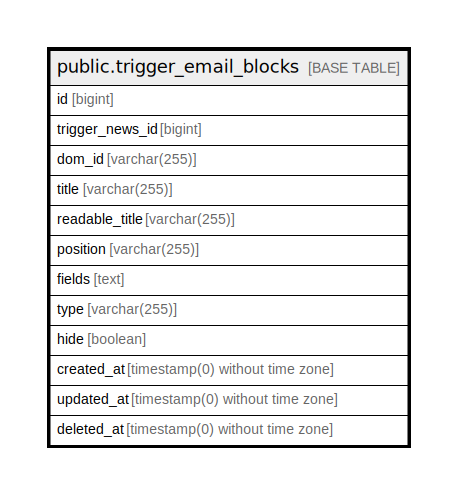

# public.trigger_email_blocks

## Description

## Columns

| Name | Type | Default | Nullable | Children | Parents | Comment |
| ---- | ---- | ------- | -------- | -------- | ------- | ------- |
| id | bigint | nextval('trigger_email_blocks_id_seq'::regclass) | false |  |  |  |
| trigger_news_id | bigint |  | true |  |  |  |
| dom_id | varchar(255) |  | true |  |  | id блока который будет присваиваться контейнеру в верстке |
| title | varchar(255) |  | true |  |  | Уникальное название для определенного типа блока |
| readable_title | varchar(255) |  | true |  |  | Название блока письма |
| position | varchar(255) |  | true |  |  | Порядок |
| fields | text |  | true |  |  | Json со структурой блока |
| type | varchar(255) |  | true |  |  | Тип письма формальное/неформальное |
| hide | boolean |  | true |  |  | Флаг - показывать не показывать блок в письме |
| created_at | timestamp(0) without time zone |  | true |  |  |  |
| updated_at | timestamp(0) without time zone |  | true |  |  |  |
| deleted_at | timestamp(0) without time zone |  | true |  |  |  |

## Constraints

| Name | Type | Definition |
| ---- | ---- | ---------- |
| trigger_email_blocks_pkey | PRIMARY KEY | PRIMARY KEY (id) |

## Indexes

| Name | Definition |
| ---- | ---------- |
| trigger_email_blocks_pkey | CREATE UNIQUE INDEX trigger_email_blocks_pkey ON public.trigger_email_blocks USING btree (id) |

## Relations

---

> Generated by [tbls](https://github.com/k1LoW/tbls)
