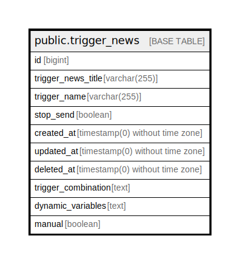

# public.trigger_news

## Description

## Columns

| Name | Type | Default | Nullable | Children | Parents | Comment |
| ---- | ---- | ------- | -------- | -------- | ------- | ------- |
| id | bigint | nextval('trigger_news_id_seq'::regclass) | false |  |  |  |
| trigger_news_title | varchar(255) |  | true |  |  |  |
| trigger_name | varchar(255) |  | true |  |  |  |
| stop_send | boolean | false | false |  |  | при создании рассылки = 1 -  что означает что данная рассылка не будет рассылаться автоматически командой news:send-unsent |
| created_at | timestamp(0) without time zone |  | true |  |  |  |
| updated_at | timestamp(0) without time zone |  | true |  |  |  |
| deleted_at | timestamp(0) without time zone |  | true |  |  |  |
| trigger_combination | text |  | true |  |  | В данном поле в массиве будет хранится список названий триггеров при срабатывании которых должно будет отправляться это письмо |
| dynamic_variables | text |  | true |  |  | Список динамических переменных которые надо вычислить для в ставки в шаблоны этого письма |
| manual | boolean | false | true |  |  |  |

## Constraints

| Name | Type | Definition |
| ---- | ---- | ---------- |
| trigger_news_pkey | PRIMARY KEY | PRIMARY KEY (id) |

## Indexes

| Name | Definition |
| ---- | ---------- |
| trigger_news_pkey | CREATE UNIQUE INDEX trigger_news_pkey ON public.trigger_news USING btree (id) |

## Relations

---

> Generated by [tbls](https://github.com/k1LoW/tbls)
